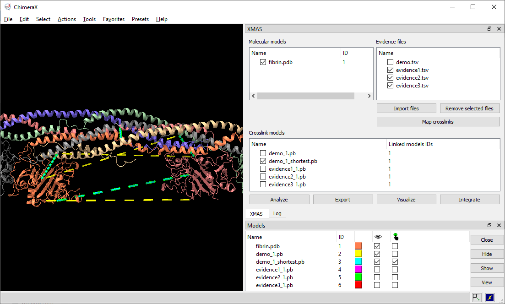

# XL Mapping and AnalySis (XMAS) with [UCSF ChimeraX](https://www.cgl.ucsf.edu/chimerax/)

[Installation instructions](user_manual/XMAS_manual.md#5-setting-up)

[Detailed user manual](user_manual/XMAS_manual.md)

Preprint: [Xlink Mapping and AnalySis (XMAS) - Smooth Integrative Modeling in ChimeraX](https://doi.org/10.1101/2022.04.21.489026 )

&nbsp;

XMAS, a bundle that allows users to load results from several XL-MS search engines directly into ChimeraX and map the information onto protein structures. Besides automatically locating distance constraints on protein structures, XMAS offers the possibility to work with replicate experiments and/or different crosslinkers, and filter this data based on the number of replicates for which a given distance constraint was detected, thereby increasing the data quality. Additionally, we introduce the concept of self-links, which allows easy modeling of homo-dimeric interactions. Its core functionality is extended by the implementation of seamless connections to the HADDOCK suite to streamline otherwise time-consuming tasks in structural modeling pipelines.

&nbsp;

&nbsp;

